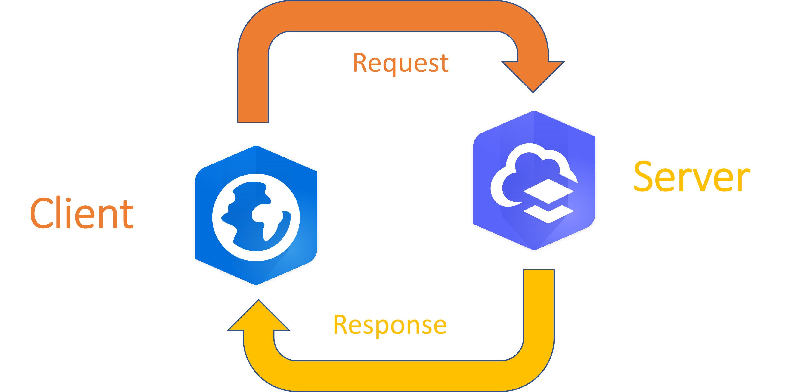

A client is an application that sends a request for a resource to some other application and receives that resource in response. That other application is called a server. Sometimes people use the words “client” and “server” to refer to the machines on which these applications run, but it is more accurate to say that clients and servers are software, not hardware. It might even be the case that a single application sometimes acts as a client by sending requests and sometimes acts as a server by responding to requests.

In the ArcGIS system, clients are typically a web browser, [ArcGIS Pro](https://www.esri.com/en-us/arcgis/products/arcgis-pro/overview), or a mobile app. When you type a URL into the browser or drag a portal content item into a map, you are using the client to make a request on that resource. [ArcGIS Online](https://www.esri.com/en-us/landing-page/product/2019/arcgis-online/overview) and [ArcGIS Enterprise](https://www.esri.com/en-us/arcgis/products/arcgis-enterprise/overview) are typically the servers. They will receive a request from the client and provide the resource.

## Exercise: Make a request for a resource
0.	In your web browser, navigate to https://umn.maps.arcgis.com
0.	In the upper right corner, click Sign In
0.	Click ArcGIS login, then provide the workshop credentials
0.	Click the Groups tab, then click the “Web Services” group
0.	Click on the thumbnail image for the RainGaugeSites shapefile to download a .zip archive of this shapefile
0. Answer these questions
    0. What was the resource that was requested when you clicked Download?
    0. Which application was the client that sent the request?
    0. Which application was the server that sent the resource?

# Summary
|              | Client    | Server    |
| ------------ | --------- | --------- |
| **Sends**    | Requests  | Responses | 
| **Receives** | Responses | Requests  |
